````markdown
# Humanitarian Aid Project

## Overview
The **Humanitarian Aid Project** is a comprehensive system designed to manage humanitarian aid operations.  
The project aims to facilitate the management of aid distribution, user tracking, notifications, and includes an integrated admin dashboard with a smooth and responsive user interface.

---

## Technologies Used

### Backend (Laravel / PHP)
- **Laravel 12**: Main framework for MVC structure and routing.  
- **PHP 8.2.12**: Server-side programming language.  
- **Laravel Sanctum**: Authentication and API token management.  
- **Maatwebsite Excel**: Exporting and importing Excel/CSV files.  
- **Pusher PHP Server**: Real-time notifications support.  
- **GuzzleHTTP**: Making external HTTP requests.  
- **Fruitcake Laravel CORS**: Enabling cross-origin requests from frontend to backend.

### Frontend (Vue3 / JavaScript)
- **Vue 3**: Frontend framework for reactive UI.  
- **Tailwind CSS**: Responsive and modern UI design.  
- **Vue Router**: Navigation between application pages.  
- **Axios**: Communicating with backend APIs.  
- **Vue Toastification**: Displaying toast messages (success, error, alerts).  
- **Pusher JS**: Receiving real-time notifications from the backend.  
- **XLSX**: Displaying Excel files directly in the browser.

---

## Main Features
- User management with roles (`Admin`, `Volunteer`, `Beneficiary`).  
- Integrated dashboard with statistics overview.  
- Management of distribution operations and request tracking.  
- Real-Time notifications via database and email.  
- Data export to Excel/CSV.  
- Responsive user interface for a smooth user experience.  
- Advanced search functionality within data.  
- Easily extendable for future features.

---

## Database Design
**Main Models:**
- **User**: Manages users and roles.  
- **Distribution**: Manages aid distribution operations.  
- **Notification**: Manages notifications.

**Relationships:**
- `User` has multiple relations with `Distribution` and `Notification`.  
- Used **One-to-Many** and **Many-to-Many** relationships depending on the data structure.  

---

## Performance Optimization
- Implemented **Eager Loading** to reduce database queries when fetching related data.  
- Partial **Caching** for heavy queries to improve performance.  
- Optimized queries in controllers to avoid N+1 problems.  

---

## Security and Authorization
- **Authentication**: Managed using Laravel Auth & Sanctum.  
- **Authorization**:  
  - Each user has a defined role (`Admin`, `Volunteer`, `Beneficiary`).  
  - Middleware used to control page and feature access based on roles.  
  - Example: Only admins can access distribution management pages.

---

## Frontend & User Experience (UI/UX)
- Responsive design using Vue3 + Tailwind CSS.  
- Smooth navigation between pages using Vue Router.  
- Reusable components for consistent interface and faster development.  
- Focused on user-friendly interface for efficient interaction with data.  

---

## Admin Dashboard Features
- User management and role assignment.  
- Real-time notifications display.  
- Statistics and data overview.  
- Role-based access control to sensitive features.

---

## Real-Time Notifications
- Database notifications and email notifications for important events.  
- Integration with frontend to display notifications immediately when triggered.  
- Toast messages for user-friendly alerts (success, error, warning).

---

## Additional Features
- Advanced search functionality.  
- Exporting data to Excel/CSV.  
- Real-Time updates and notifications.  
- Multi-language support ready for future expansion.

---

## Running Locally
1. Copy environment file and generate application key:
```bash
cp .env.example .env
php artisan key:generate
````

2. Configure database credentials in `.env` and run migrations with seeders to create tables and sample data:

```bash
php artisan migrate --seed
```

3. Start the backend server:

```bash
php artisan serve
```

4. Install Node.js dependencies for frontend:

```bash
npm install
```

5. Start the frontend development server:

```bash
npm run dev
```

---

## Contribution

This project is open for enhancements, including:

* Adding multi-language support.
* UI/UX improvements.
* Additional reporting and notification features.

---

## License

This project is open-source under the **MIT License**.

## Screenshots

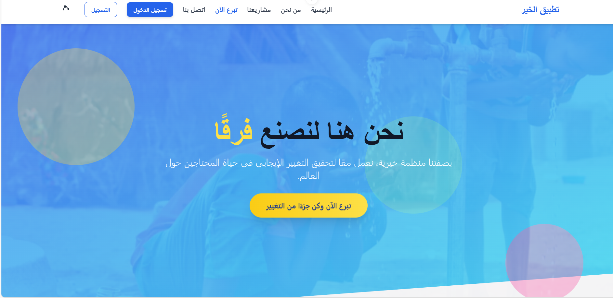
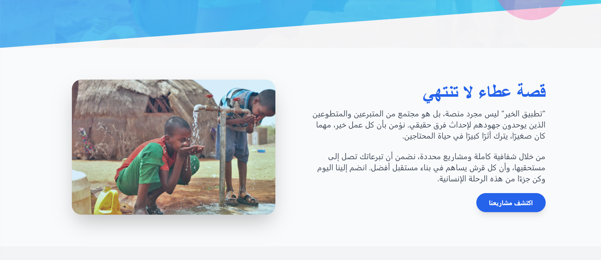
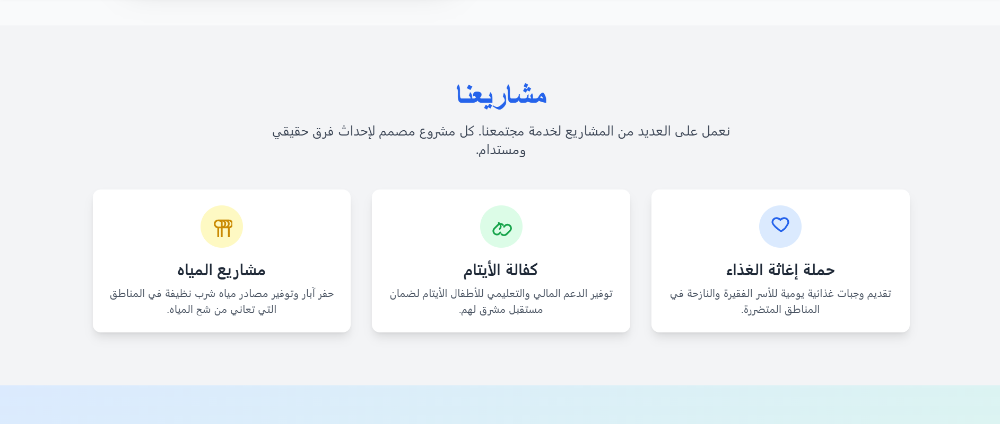
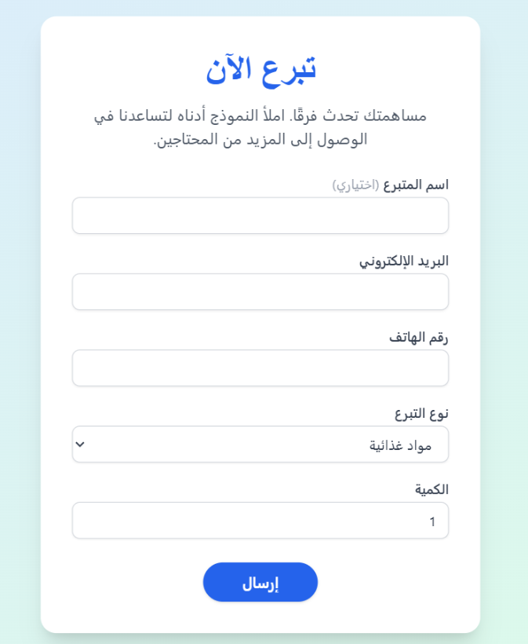
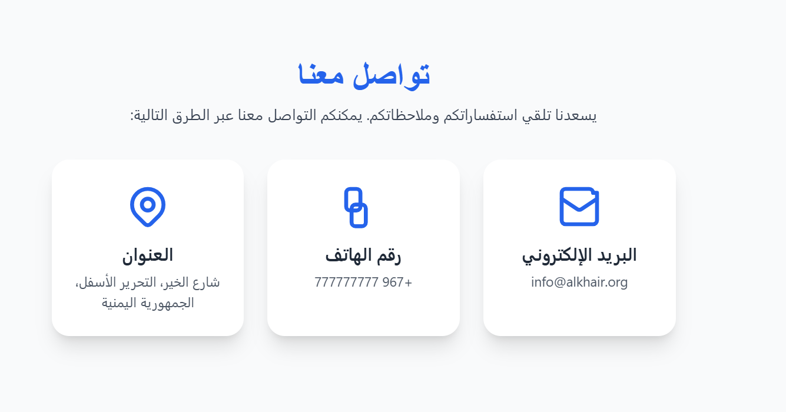
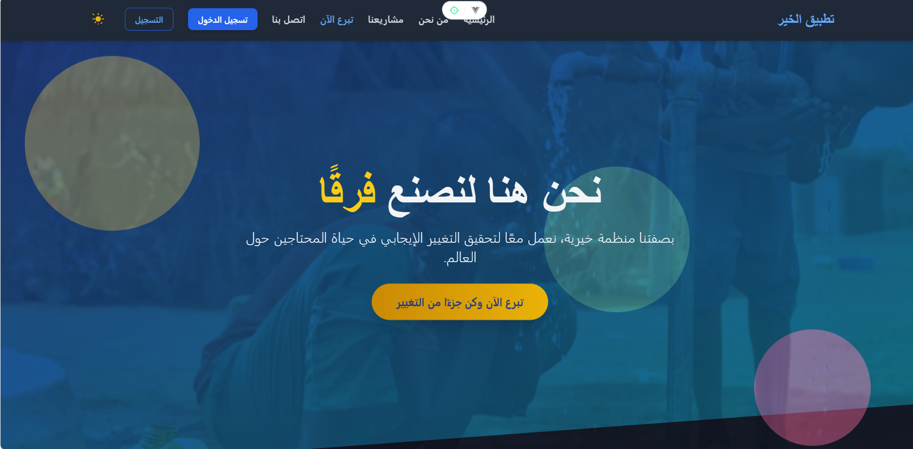
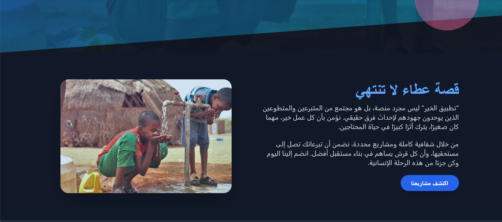
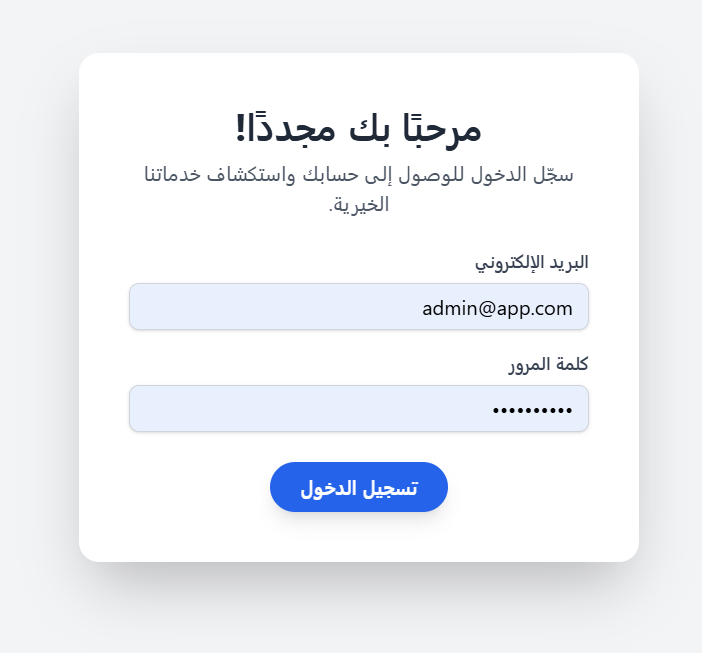
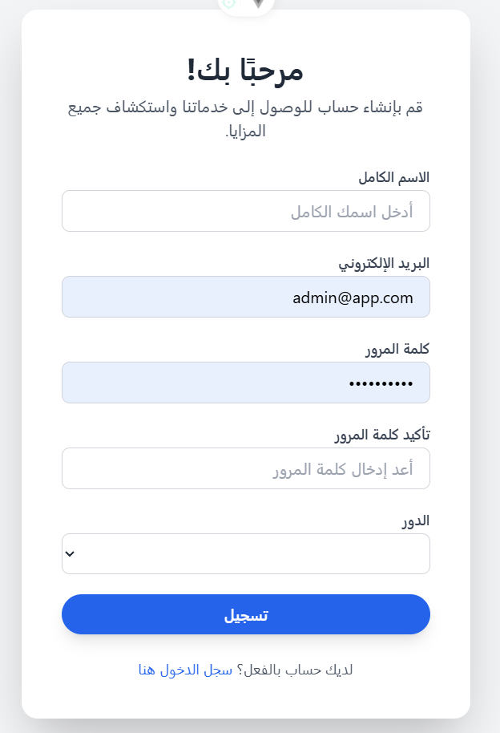
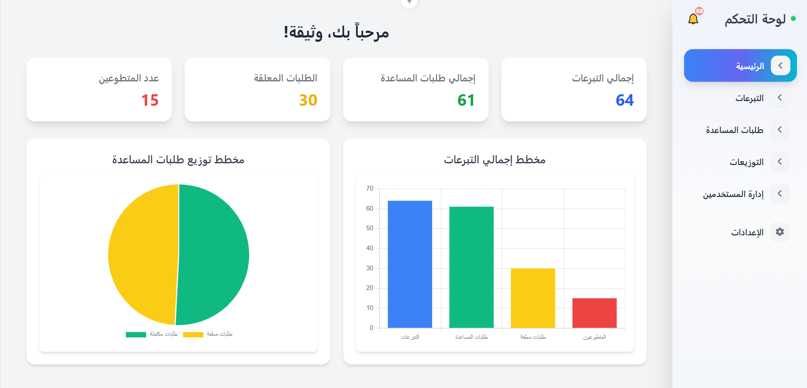
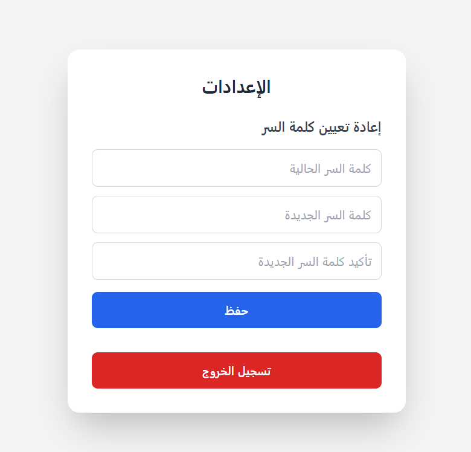
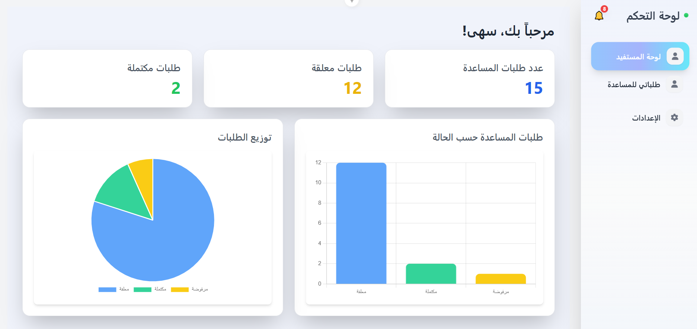
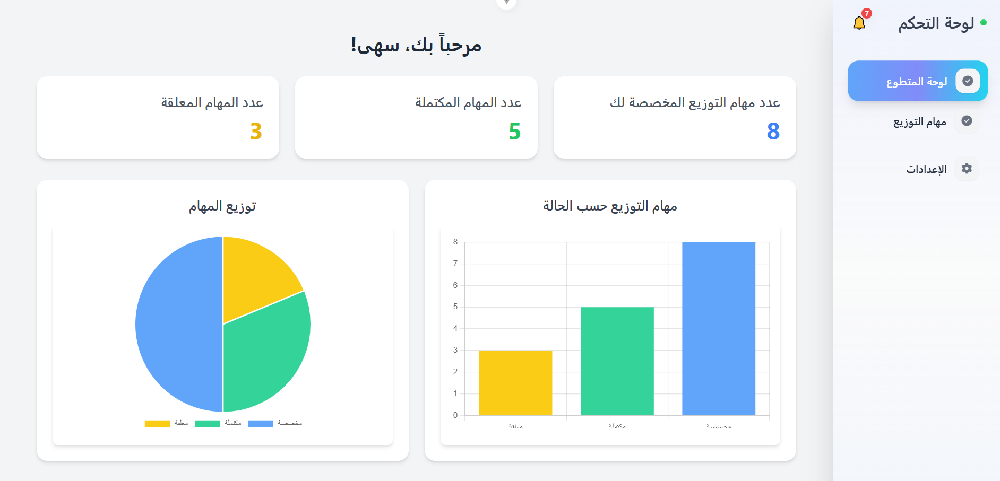

```

